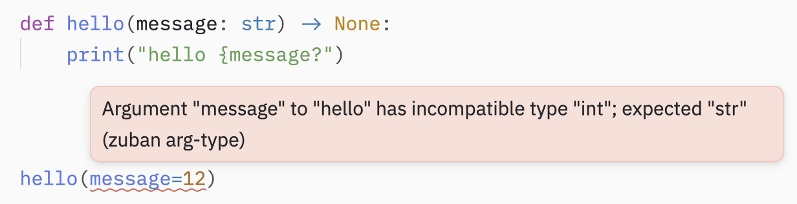
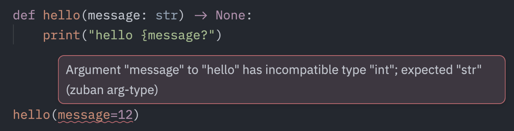

# Coder en Python

> Écrire du Python quand on vient de R, c'est moins apprendre un nouveau langage que désapprendre certains réflexes.

Ce chapitre explore les concepts clés, les différences majeures entre les deux langages, et les bonnes pratiques pour écrire du code Python propre et lisible. Voici les principaux aspects abordés :

- Concepts importants, concepts qui n'existent pas sur R ou qui existent différement

- Outils pour la qualité du code

- Éléments de syntaxe

---

## Syntaxe

### Indentation

Il est impossible de parler de la syntaxe de Python sans aborder l'indentation.

L'indentation sert à définir les blocs de codes (fonctions, classes, for loop, if statements,...). Python attends que l'indentation soit la même pour toutes les lignes d'un bloc.

> Ne pas respecter l'indentation entrainera une `#!py3 IndentationError` lors de l'exécution.

Cela diffère de R, qui utilise plutôt les parenthèses et où l'indentation sert uniquement à la lisibilité du code). 

La lecture du code passe par l'identification des niveaux d'indentation. Dès que le niveau change, je rentre ou je sors d'un bloc de code.

??? note "Exemple" 
    
    Dans cet exemple, tout le code est contenu dans un while loop (niveau 1 d'indentation).   
    À l'intérieur du loop, 3 if statements qui ajoutent un niveau d'indentation exclusivement pour le code du if statement (chacun niveau 2 d'indentation).
    
    ```python {hl_lines="1 5 12 18"}
    while True:
        paginated_query = f"{query} LIMIT {limit} OFFSET {offset}"
        page = pl.read_database(paginated_query, conn)
    
        if page.is_empty():
            break
    
        pages.append(page)
        fetch_count += 1
        print(f"Fetched {offset + len(page)} rows...")
    
        if len(page) < limit:
            break
    
        offset += limit
    
        # Sleep every 4 fetches to respect the rate limit
        if fetch_count % 4 == 0:
            print("Rate limit pause: 70 seconds...")
            time.sleep(70)
    ```
    

### Type hints

En 2 mots : On précise le type attendu de l'élément avec la syntaxe "élément: type"
```python
a: int = 12
```

/// info | Les type hints de Python n'ont pas vraiment d'équivalent sur R.   
Sur R, il est possible de vérifier les types avec des packages comme [checkmate](https://mllg.github.io/checkmate/), mais le langage lui-même ne propose pas de syntaxe pour les indiquer comme Python le fait.
///


Comme leur nom l'indique, elles sont **optionnelles** et n'ont aucun impact sur l'exécution du code (simplement ignorée par Python), alors pourquoi on s'embête avec ça ?

- Lisibilité
- Aide à comprendre le code et le prendre en main
- Permet au développeur de corriger des erreurs directement dans l'éditeur au lieu de les découvrir pendant l'exécution.

Avec les annotations, on retire les ambiguïtés.

Python supporte nativement les types de base : 

```python
# Variable
age: int = 21
nom: str = "Mathis"
prix: float = 9.99
actif: bool = True

# Signature de fonction (arguments et élément retourné)
def salut(nom: str) -> str:
    return f"Bonjour, {nom}"
```

??? note "Types plus complexes"

    ```python
    items : list[]
    items : dict[]
    items : tuple[]
    
    # On peut aussi préciser les éléments contenus
    list[int]
    dict[str, int]
    
    
    # On peut exprimer des conditions sur les types
    def trouver(id: int) -> str | None:  # str ou None - on utilise l'opérateur '|' pour 'ou'
        ...
    
    from typing import Literal # le module typing contient les types plus complexes
    
    def towers_of_paris(value: Literal["Eiffel", "Montparnasse"]) -> None:  # 'value' ne peut prendre que deux valeurs bien précises'
        ...
    ```


??? note "Exemple d'utilisation des types hints"

    ```python
    from typing import TypedDict # TypeDict permet de définir la "forme" attendue d'un dictionnaire avec le type de chacune des clefs
    
    class ChunkResult(TypedDict):
        chunk_id: int
        chunk_text: str
        publish_date: date
        _distance: float
        
    def retrieve(retrieval_query: str, doc_id: int | list[int]) -> list[ChunkResult]:
        ...
    ```
    
    - On définit le dictionnaire ChunkResult.   
    
    - Dans la fonction, on indique qu'elle retourne une liste de dictionnaires ChunkResult.   
    
    - On sait ce que retourne la fonction et ce que contient chaque éléments de la liste retournée.
    
    - On pourra utiliser ChunkResult ailleurs dans le code et toujours savoir précisément ce qu'il doit contenir.

??? warning "Type hints avant Python 3.9+"

    Les types hints en minuscules présentés au-dessus ne sont implémentés par Python que depuis la version 3.9.
    
    Pour Python 3.8 et versions antérieures, il faut importer les types depuis typing. 
    
    Tu peux faire la différence entre les deux car la syntaxe de typing a des majuscules pour la première lettre alors que Python 3.9+ est uniquement en minuscules.
    
    ```python
    from typing import List, Dict, Tuple
    ```
    
### List comprehension

Les list comprehensions sont de la syntaxe Python pure. C'est juste une autre manière d'écrire les boucles. Et les boucles sont très présentes dans Python, bien plus que dans R.

En fait, les boucles (et list comprehensions), sont le moyen pour Python d'effectuer les opérations qui sont vectorisées dans R (*c'est vrai pour Python pur, NumPy et Pandas retrouvent la vectorisation*). Python doit itérer au-dessus de chaque élément. De ce point de vue là, R est bien plus optimisé.

```python
# version for loop
results = []
for x in range(10):
    if x % 2 == 0:
        evens.append(x)

# version list 
results = [x for x in range(10) if x % 2 == 0]

# % est l'opérateur Python pour 'modulo'
```

Comment décomposer les listes comprehensions ? 

/// tip | Squelette
`#!py3 [expression for item in iterable if condition]`
///

0. Lire de droite à gauche
1. Identifier la condition : [x for x in range(10) ==if x % 2 == 0==]  
2. Identifier le for loop : [x ==for x in range(10)== if x % 2 == 0]  
3. Combiner **1.** et **2.**. 
4. Ensuite, on rajoute l'expression (le ==x== avant le for loop), qui nous indique ce qui est extrait de la liste (pour devenir "results" dans notre exemple). 

Les listes comprehensions sont partout dans Python, car c'est une syntaxe élégante pour exprimer les boucles simples. De plus, elles sont plus performantes que les boucles (optimisées par l'interpréteur Python). Deux raisons d'essayer de s'en servir !

R ne connait pas les listes comprehensions puisque tout est un vecteur dans R donc il est naturel de paralléliser les opérations et ainsi ne pas avoir à itérer sur chaque élément. On peut faire un parallèle avec la famille `apply(), sapply(), lapply()...` de R, mais l'approche est différente, parce qu'elles appliquent une fonction.

La list comprehension n'est pas la seule, c'est la plus utilisée, mais il existe aussi :

- les *dictionary comprehensions* (`#!py3 {k: v for k, v in ...}`)
 
- les *set comprehensions* (même syntaxe que la list comprehension avec `{}` à la place des `[]`)

- les *generator comprehensions*. (même syntaxe que la list comprehension avec `()` à la place des `[]`)

---

## Type checker, Formateur et Linter

**Trio de choc** pour écrire un code irréprochable.

### **Type checker** - le physio de boite de nuit

> ***Si t'as pas le bon type, tu rentres pas.***

Le type checker est un logiciel qui vérifie que les types annoncés dans les types hints sont bien ceux utilisés par le code. [Pyrefly](toolkit.md) est présenté dans la section toolkit.

Exemple :

{.only-light}
{.only-dark}

C'est particulièrement utile quand on utilise des fonctions que l'on ne connait pas ou que l'on n'est pas certains types de variables demandés par les arguments.

Le type checker peut être ajouté à l'IDE pour pointer les erreurs en même temps que le code est écrit.


### **Linter** - l'inspecteur des impôts

> ***Il va fouiller chaque ligne de ton code à la recherche de la moindre erreur. Tu peux rien lui cacher.***

Le linter détecte les autres les erreurs et les mauvaises pratiques dans le code. Ruff est présenté dans la [section toolkit](toolkit.md).  

Il fait une analyse statique du code et met en valeur :

- les variables définies et jamais utilisées

- variables déclarées plusieurs fois

- les imports impossibles, les imports manquants

- les codes impossibles (par exemple du code après le `return` d'une fonction)

Comme le type checker, le linter est le mieux utilisé avec l'IDE, comme un assistant discret qui t'indique tous les problèmes avec des petites vagues de couleur sous les erreurs.

### **Formateur** - le styliste

> ***Le formateur s'occupe uniquement de l'apparence. On l'a embauché parce qu'il est à cheval sur les règles.***

Il réécrit le code (mais il ne peut pas en changer le sens) pour qu'il suive les standards de Python. Ainsi pas besoin de faire l'effort d'aérer le code, de supprimer les lignes vides inutiles...  
En plus d'un code 'plus beau', un code standardisé visuellement est plus simple à lire par pour tous car on a l'habitude de voir ces silhouettes de blocs de code.

Une des règles les plus importantes et la longueur maximum des lignes, qui assure que le code soit toujours lisible en entier sans déborder hors de l'écran sur la droite, par exemple pour les petits écrans, ou pour les screenshots...

Le formateur est aussi intégré dans l'IDE. On le configure par défaut pour qu'il run à chaque fois que le code est sauvegardé. Tu est donc à un ++ctrl+s++ d'un beau script.

Ruff est présenté dans la [section toolkit](toolkit.md).  

??? info "Et pour R ?"

    - R n'intègre pas les types dans sa syntaxe et ne peut donc pas utiliser un type checker comme Python.  
    
    - Le linting sur R est fait par [lintr](https://lintr.r-lib.org/), qui s'intègre dans l'IDE. Mais n'a pas le niveau de contrôle des erreurs et de performances de Ruff. 
    
    - R a depuis peu un super formateur : [Air](https://tidyverse.org/blog/2025/02/air/), écrit en Rust, c'est le jumeau du formateur de Ruff pour R.
  
  
---

## Bonne pratiques de Python

- **Import**

Contrairement à R, on détaille chaque éléments importés quitte à avoir 50 lignes d'imports en haut du script.

```python
# ⚠️ mauvaise pratique, importe tout ! crée des conflits et rend le code illisible
from sklearn import *
```

```python
# ✅ Bonne pratique :  On importe uniquement ce dont on a besoin. 
# Le linter indiquera les imports inutilisés
from sklearn.linear_model import LinearRegression
from sklearn.model_selection import train_test_split
```

L'import explicite rend immédiatement visible d'où vient chaque outil utilisé dans le code.

**Utiliser des alias**

Les packages de data sciences aiment particulièrement les alias, qui sont devenus des conventions universelles. Les respecter rend le code lisible par n'importe quel utilisateur de Python :
```python
import numpy as np
import pandas as pd
import polars as pl
import matplotlib.pyplot as plt
import seaborn as sns
...
```

En dehors de ces conventions établies, évite les alias arbitraires, ils ajoutent une couche mentale inutile pour quiconque lit le code.

- **Noms** :

Python suis une [convention](https://peps.python.org/pep-0008/#introduction) sur la manière d'écrire les différents éléments :

| Type | Convention d'écriture | Exemple |
| --- | --- | --- |
| Fonction | minuscules avec underscores | `#!py3 def preprocess_data():` |
| Variables | minuscules avec underscores | `#!py3 df_round1_2026` |
| Classe | PascalCase | `#!py3 class LegalReports:` |
| Constante | MAJUSCULES avec underscores | `#!py3 API_KEY = "abc"` |

/// warning | Il y a des exceptions
  
En machine learning, on utilise `X`, `X_train`, `X_test`. Héritage des statiques qui écrit les matrices en majuscules pour les différencier des vecteurs ou des scalaires.  
La variable expliquée (y), est elle, gardée en minuscule (car c'est un vecteur).
///

---

## Class et def

### Classes avec class

> Avant toutes choses : comprendre les classes est utile, mais tu ne seras probablement pas amené à en écrire souvent.

Pour comprendre ce qu'est une classe en Python, un peu de contexte :

Il y a grossièrement deux types de programmation :  

- programmation fonctionnelle, on manipule plutôt des fonctions (comme dans R)  

- programmation orientée objet (POO), on manipule plutôt des objets (comme avec C++)  

Python est un langage généraliste avec un écosystème très large et qui peut être bien loin des data sciences. Il supporte des paradigmes des deux types de programmations. 

??? info "Qui utilise plutôt la programmation orientée objet dans Python ?"

    - Développeur web  
    
    - Développeur d'application  
    
    - Développeur d'API    
    
    - Développeur de librairies  
    
C'est la raison pour laquelle, si tu codes en Python, tu vas rencontrer des concepts de programmation orientée objet que tu n'as jamais vu sur R (ou sans t'en rendre compte), car ils sont plutôt utilisés par les développeurs de packages.

À la différence de la fonction donnée par `def()` que tu connais déjà, les objets Python sont donnés par `class`.

En 2 mots, `class` est un moule qui définit deux choses :

- les attributs de l'objet (les données portées par l'objet)

- les méthodes (des fonctions qui appartiennent à l'objet)

Une classe Python ressemble à ça :

```python
class Animal:
    def __init__(self, nom, espece):   # constructeur, obligatoire
        self.nom = nom                 # attribut
        self.espece = espece

    def presenter(self):               # méthode
        print(f"Je suis {self.nom}, un {self.espece}")

# Utilisation
chat = Animal("Mimi", "chat")         # on crée une instance
chat.presenter()                      # seules les instances de 'Animal' peuvent utiliser la méthode 'presenter()'
-> Je suis Mimi, un chat
```

??? note "Comparatif entre la syntaxe Python et R qui reflète cette différence de langage"

    ```python
    # La syntaxe de Python utilise beaucoup les méthodes :
    df.head() # <- le '.' indique une méthode, la fonction head() est une méthode de l'objet df
    ```
    Dans le bloc du ci-dessus **df** est un dataframe crée avec Pandas.  
    On a donc instancié df à partir de l'objet DataFrame de Pandas :
    ```python
    import pandas as pd
    
    df = pd.DataFrame(data={"col1": [1, 2], "col2": [3, 4]}) 
    # ici pd.DataFrame() n'est pas une fonction mais une instance de la classe. Orientation objet
    ```
    
    ```python
    # Quelque part dans le code source de Pandas, DataFrame est déclaré avec un bloc comme :
    class DataFrame:
        ...
    ```
    
    Sur R :
    
    ```r
    # Sur R on interagit plutôt avec des fonctions qu'avec des objets. 
    # On applique une fonction sur un objet alors que Python prend un objet et lui applique une méthode associée.
    # Si on prend le même df, pour voir les 5 premières lignes on ferait :
    head(df)        # En R de base
    
    df |>
      head()        # En R de Tidyverse
    ```
    `head()` n'est pas une fonction exclusive à la classe de df, mais une fonction qui **consomme** un objet comme df (là est une des différences entre Python et R).
    
    Sur R, une grande partie des data sciences est structurée autour du **Tidyverse** ce qui renforce la compatibilité entre les fonctions des packages.  
    L'acteur principal du Tidyverse est le dataframe (data.frame ou tibble) et tous les packages du Tidyverse sont conçus pour manipuler ce type d'objet avec des conventions communes.   Il est donc simple de développer des fonctions qui consomment un dataframe plutôt que de redéfinir l'objet dataframe et de lui ajouter des méthodes comme Python le fait.  
    
    Un très bon exemple est `ggplot2`, qui prend un dataframe en input alors qu'il retourne un plot. Sous le capot, `ggplot2` utilise la programmation orientée objets (pour gérer les couches par exemple) mais toi tu interagis simplement avec les fonctions.


### Fonctions avec def

`#!py3 def():` est le mot clef pour écrire une fonction.

```python
# La première ligne s'appelle 'la signature' de la fonction. 
# A gauche de la flèche, les inputs, à droite les outputs.
def bonjour(argument1: int, argument2: str) -> tuple[int, str]:  
    """
    Ici c'est le docstring pour expliquer la fonction.
    La convention pour détailler les arguments et ce que la fonction retourne est :
    Args:
        argument1: est le premier argument
        argument2: est le deuxième argument
        
    Return:
        nombre, texte: tuple[int, str] est un tuple avec un nombre et un texte
    
    Tu n'est pas obligé de tout détailler si tu penses que la fonction est suffisamment explicite avec sa signature.
    """
    nombre = argument1 * 2
    texte = f"bonjour {argument2}"
    
    return nombre, texte
```

/// info | Différences avec R : 
///

**return obligatoire/ pas de return implicites** : En Python, il est impératif d'avoir le mot clés `#!py3 return`. Autrement la fonction ne renvoie rien (ou None par défaut). Cela diffère de R, qui retourne automatiquement la dernière expression évaluée dans la fonction, le `#!py3 return`de R étant donc souvent optionnel.

**Retourne toujours qu'un seul objet** : même `#!py3 return a, b` retourne en fait un unique tuple constitué de a et b. Cela diffère de R qui peut retourner **des** listes ou **des** vecteurs.

**Pas de {} pour délimiter les blocs** : En Python, les blocs de code (comme les fonctions) sont définis par l'indentation. Contrairement à R qui utilise des parenthèses {}.
