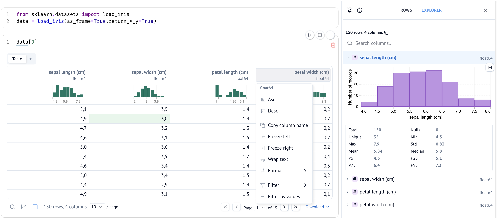

# Notebooks

Pourquoi une autre librairie de notebooks alors que Jupyter existe, et qu'il sert autant pour R que Python ?


??? note "Critiques de Jupyter"
    
    Le notebook Jupyter est un outil où la *flexibilité* prime, c'est formidable pour l'exploration rapide, l'apprentissage ou le prototypage. Pourtant, cette liberté a un coût. Dès que le code gagne en complexité ou s’intègre à un workflow de production, elle se transforme en contrainte, minant la reproductibilité et favorisant les mauvaise pratiques de code.
    
    
    - État caché et ordre d'exécution
    Les cellules Jupyter peuvent être exécutées dans n'importe quel ordre, ce qui crée un problème subtil :
    ```python
    # Cell 1
    a = 10
    # Cell 2
    b = a * 2
    print(b)  # affiche 20
    ```
    
    Si je modifie `a = 5` dans la cellule 1 sans re-exécuter la cellule 2, le notebook affiche toujours `b = 20`, une valeur qui ne correspond plus au code visible. C'est le **hidden state** : l'état réel du kernel diverge silencieusement de ce qu'on lit.  
    
    Concrètement, ça mène à un pattern fréquent : les premières cellules tournent bien, on modifie des valeurs au fil de l'exploration, et à un moment le notebook retourne une erreur ou un résultat inattendu, sans qu'on sache exactement quelle combinaison de cellules avait produit le bon résultat.
    
    - Reproductibilité :  
    C'est la conséquence directe de l'état caché : relancer le même notebook du début à la fin peut produire des résultats différents de ceux affichés, voire planter. Ça demande une discipline constante pour s'assurer que les cellules sont dans le bon ordre et que les variables sont dans l'état attendu.
    
    - Git diff illisible :  
    Le format `.ipynb` mélange code et outputs sérialisés en JSON, ce qui rend les diffs quasiment inexploitables pour une revue de code.
    
    S'inspirant de Jupyter et de ses problèmes, des alternatives ont vu le jour, proposent un outil moins permissif pour atténuer/ retirer ces problèmes :  
    - Pour R, [Quarto](https://quarto.org/) adresse une partie de ces problèmes.  
    - Pour Python, [Marimo](https://marimo.io/), présenté dans le reste du chapitre.

[Marimo](https://marimo.io/) est une alternative moderne conçue explicitement pour ne pas avoir les mêmes problèmes que Jupyter. 

Les avantages de marimo :  
  - Moderne : réactivité, intégration  
  - Meilleure intégration avec Python  
  - Versioning avec Git comme un script classique  
  - La philosophie  
  - Éditeur complet  
  - Projet mature, maintenu et avec un communauté croissante  
    
## Philosophie

**Marimo défend une autre vision de la simplicité** : un notebook n’est pas forcément plus simple quand tout est permis, mais plutôt quand des règles claires encadrent les usages et préviennent les erreurs.   
On retrouve ici la philosophie de la communauté Python elle même, qui aime définir des règles et les suivre, non pas pour restreindre, mais pour mieux structurer le code. C’est ce qui permet de collaborer efficacement.

### Python first
Marimo n'a pas de format à part comme Jupyter (**.ipynb**), c'est un simple script Python (**.py**).  

Cela donne trois avantages majeurs : 

- **Git fonctionne**. Jupyter produit un fichier JSON, qui n'est pas idéal pour correctement voir les différences entre deux versions du fichier.

- **Pas besoin conversion entre notebook et script**. Le notebook peut être run comme un simple script Python. Si run directement, toute la partie visuelle et interactive du notebook est exécutée sans rendu visuel.   
Par exemple, si le notebook explore et nettoie un dataset avec des plots et retourne un fichier csv dans le dossier `data`. Alors run le notebook avec `#!shell uv run marimo_nb.py` va process les données et retourner le fichier csv comme l'aurais fais un équivalent script du notebook.

- **Intégration avec Python**. Comme le notebook est juste un script Python, on peut définir des fonctions, des classes, et les importer dans d'autres scripts Python ou notebooks. 

### Moderne
- Réactivité : Quand on change la valeur d'une variable dans une cellule, toutes les cellules qui dépendent de cette valeur sont automatiquement actualisée.
- Elements interactifs : Comprend un panel d'éléments intégratifs qui marchent directement avec la ractivité du notebook. Par exemple un slider pour choisir une valeur, changer les bornes de l'axe d'un graphique...

### Réactivité (fonctionnement et contraintes)
Pour avoir la réactivité du notebook, il doit respecter certaines règles qui ne sont pas présentes dans Jupyter :

- variables uniques : Condition nécessaire pour la réactivité. Si je crée `a = 2` dans la première cellule, alors je ne peux pas écrire `a = 4` dans la deuxième.  
Cela peut paraitre contraignant au premier abord, s'oppose aux habitudes de Jupyter et crée le *"forcé de constamment inventer des nouveaux noms pour tester de nouveaux codes (aa= 4 puis aaa=5)"*. Mais en réalité, il y a des vrais bénéfices pour la stabilité, la robustesse, la clarté et reproductibilité du script.  

??? note "Exemple"

    Reprenons l'exemple du début du chapitre :
    
    ```python
    # Cell 1
    a = 10
    # Cell 2
    b = a * 2
    print(b)  # affiche 20
    ```
    Si je change pour `a=5`, la cellule 2 va automatiquement s'actualiser avec la nouvelle valeur `b=10`. (Tu peux désactiver la réactivité automatique, dans ce cas la cellule 2 gagne une bordure rouge qui indique qu'elle n'est pas à jour avec le reste du notebook.)
    
## Fonctionnalités de Marimo

Marimo, comme JupyterLab, contient un environnement complet avec différents panels et intégrations, qui rendent son utilisation simple et intuitive.  
Je ne présente pas tout ici, je te laisse découvrir le reste.

- **Package manager intégré**, qui te laisse installer des packages sans passer par le terminal, et qui affiche un pop up si tu essaye de run une cellule avec un package qui n'est pas installé dans l'environnement virtuel. Marimo fonctionne très bien avec UV et Pixi.
 - **Mode "sandbox"** : environnement isolé à la volée, enlève le besoin de se préoccuper de l'environnement virtuel du projet. 
- **Data explorer** : Widget interactif pour les dataframes, explorateur de rows et de colonnes avec des graphiques des distributions, et un constructeur de graphique no-code. Tout pour rapidement manipuler et explorer les données, sans devoir écrire du code pour interagir avec les données. (Quand je découvre des nouvelles données je passe toujours par là)


- **Documentation** : Clique sur une fonction et affiche sa documentation dans un panel.
- **Scratchpad** : C'est comme une cellule indépendante du notebook, tu peux tester tes codes, utiliser les mêmes noms de variable que dans le notebook sans que marimo retourne une erreur. 

Marimo inclut aussi une section spéciale pour les secrets, un terminal intégré et supporte le formatting avec Ruff.  

/// admonition | 
    type: tip 
    
**L'ensemble rend le travail de données à la fois plus agréable et plus puissant qu'avec un IDE classique.**
///
