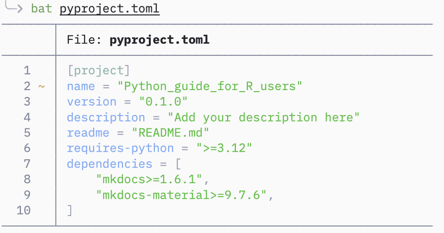
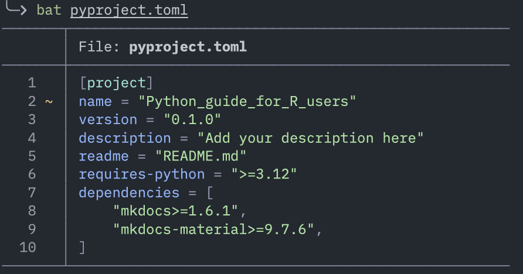
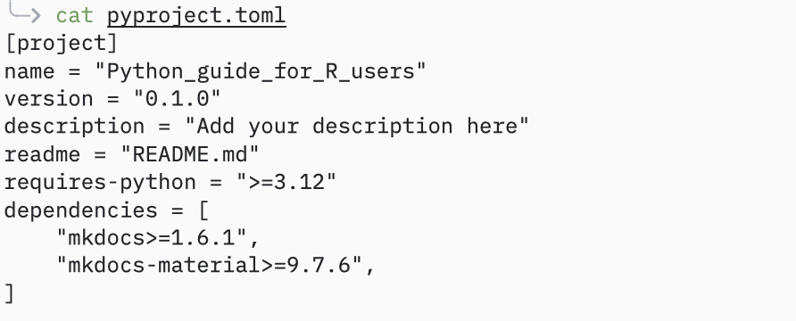
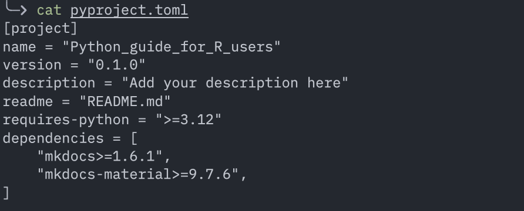

# Toolkit

/// quote | Le bon outil au bon endroit, c'est mieux.         - Moi
///

Cet chapitre regroupe les logiciels présentés dans les autres parties du guide.

/// example | **TL;DR — Mon setup recommandé si tu viens de R**
- IDE : Positron
- Environnement : uv
- Dataframe : Polars
- DataViz : Seaborn ou Plotnine
- Statistiques : statsmodels
- Notebooks : Marimo
///


## Python

Outils de l'écosystème pour coder en Python.

??? note "[Positron (IDE)](https://positron.posit.co/)"

    Positron est un fork de VSCode par Posit, pensé pour les datasciences et pour créer un outil Python et R familier aux développeurs R. 
    
    > En 2 mots : c'est VSCode qui se déguise en RStudio. VSCode *pensé* pour les datasciences.  
    
    Les avantages majeurs par rapport à VScode sont :
    - Support de R et de Python nativement
    - Même layout que RStudio - même logique que RStudio
    - Data explorer
    - UI adaptée pour Python et R (passage de Python à R et de choix de l'environnement virtuel ergonomique)
    - Support natif pour Quarto, Shiny, Air (formateur pour R)
    
    C'est donc un IDE moderne, qui propose une meilleure expérience (plus intégrée) pour les data sciences et l'exploration de données que VSCode.  
    Positron s'inspire beaucoup de RStudio et pour le mieux.
    
    
    > Posit ne compte pas arrêter de supporter RStudio, qui reste le meilleur outil pour développer en R. 
    > Positron est une super alternative pour tout utilisateur de R qui doit se mettre à Python.


??? note "[UV (gestionnaire d'environnement)](https://docs.astral.sh/uv/pip/environments/)"

    UV est présenté dans la [section sur les gestionnaires d'environnements](python.md).  
    
    Commandes les plus utiles de UV
    
    ```sh
    # Doc de la CLI
    uv help 
    # détail d'une commande
    uv help <command>  # ex : uv help init
    
    # Initialiser un projet
    uv init <nom-projet>
    
    # Ajouter/ supprimer un package
    uv add <package>
    uv remove <package>
    
    # Installer ou mettre à jour l'environnement virtuel
    uv sync
    
    # Schema des dépendances du projet sous forme d'arbre
    uv tree
    
    # Run une commande
    uv run <command>  # ex : uv run marimo edit <notebook.py>
    
    # Run un script
    uv run <script.py>  # version compacte de 'uv run python <script.py>'
    ```

??? note "[Pixi (gestionnaire d'environnement pour conda)](https://pixi.prefix.dev/latest/)"
    
    Pixi est présenté en détails [ici](python.md).
    
    Commandes les plus utiles de Pixi
    
    ```sh
    # Doc de la CLI
    pixi help 
    # détail d'une commande
    pixi help <command>  # ex : pixi help init
    
    # Initialiser un projet
    pixi init <nom-projet>
    
    # Rechercher/ ajouter/ supprimer un package
    pixi search <package>
    pixi add <package>
    pixi remove <package>
    
    # Installer ou mettre à jour l'environnement virtuel
    pixi install
    
    # Schéma des dépendances du projet sous forme d'arbre
    pixi tree
    
    # Ouvrir un shell avec l'environnement (remplace 'conda activate', plus besoin de 'conda deactivate', il suffit de faire 'exit')
    pixi shell
    
    # Run une commande
    pixi run <command> # ex : pixi run python <file.py>
    ```
    
??? note "[Ruff (linter and formateur)](https://docs.astral.sh/ruff/)"

    Ruff devient progressivement LE formateur et linter de Python, extrêmement rapide et très bien intégré/ supporté par les IDE.  
    
    > Le formateur et le linter de Ruff sont en fait deux sous commandes distinctes, et tu peux n'utiliser que l'un ou l'autre.
    
    Je recommande d'utiliser Ruff avec l'IDE. Chaque fois que tu sauvegardes ton script, ruff le formate. Positron utilise Ruff par défaut.
    
    Tu peux également peux utiliser Ruff depuis le terminal.
    ```sh
    ruff check <script.py>    # linter
    ruff format <script.py>   # formateur
    # ou voir toutes les commandes
    ruff help
    ```

??? note "[Pyrefly (type checker)](https://pyrefly.org/en/docs/)"

    Pyrefly est un Type checker pour Python, extrêmement rapide.
    
    Comme pour Ruff, Pyrefly est le type checker par défault de Positron.
    
    /// info | Pyrefly est encore jeune dans l'écosystème.
    Si tu veux savoir pourquoi les développeurs de Positron l'on choisit, tu peux lire [cet article](https://positron.posit.co/blog/posts/2026-03-31-python-type-checkers/#what-we-chose).
    ///
    
> [En savoir plus sur les formateurs de code, linters de code et les type checker](coder_python.md)


## Librairies Python pour aider la transition depuis R

Cette section fait le lien direct entre les packages que l'on utilise sur R et leur équivalent ou solution la plus proche en Python. Soit parce que la philosphie du package R est préservée, soit parce que la librairie est plus facile à prendre en main que le standard de Python.

Datasets :

- [Polars](https://pola.rs/) - Synthax expressive proche de dyplr, method chainning. Évite la rugosité de la syntaxe de Pandas quand on vient de R. Lazy mode comme [dtplyr](https://dtplyr.tidyverse.org/) et [duckplyr](https://duckplyr.tidyverse.org/).

??? example "Comparatif syntaxe dplyr, polars and pandas"

    ```r
    # dplyr
    df |>
        filter(mpg > 20) |>
        select(cyl, mpg) |>
        mutate(kpl = mpg * 0.425)
    ```  
    
    ```python
    # polars
    df.filter(pl.col("mpg") > 20) \
        .select(["cyl", "mpg"]) \
        .with_columns((pl.col("mpg") * 0.425).alias("kpl"))
    ```
    
    
    ```python
    # pandas
    df = df[df["mpg"] > 20][["cyl", "mpg"]]
    df["kpl"] = df["mpg"] * 0.425
    ```


Data Viz :

- [Seaborn](https://seaborn.pydata.org/) - Seaborn est une surcouche de Matplotlib, on utilise les deux librairies ensemble. API moins ruguese que Matplotlib pour les utilisateurs venant de R. Il permet juste de mieux et plus facilement exprimer le graphique, ce qui est souvent difficile avec Matplotlib en venant de ggplot2.
- [Plotnine](https://plotnine.org/) - ggplot2 porté sur Python (syntaxe pratiquement identique à ggplot2, lifesaver si on vient de R).
- [Great Tables](https://posit-dev.github.io/great-tables/articles/intro.html) : package gt de R, mais sur Python.

Notebooks :

  - [Marimo](https://marimo.io/) - Notebook pur Python, réactif, riche et moderne. [Détails ici](notebooks.md).
  - [Jupyter](https://jupyter.org/) : Jupyter reste le standard historique, mais Marimo corrige plusieurs de ses limitations.
    
    
## L'écosystème de Python pour les data sciences et les statistiques
(uniquement les packages principaux, les plus utilisés, les plus populaires ou les plus utiles quand on vient de R)

### Scientifique
- [Numpy](https://numpy.org/): implémentation pour Python des vecteurs (même logique que R, tout est un array (multidimensionnels contrairement aux vecteurs 1D de R))
- [Scipy](https://scipy.org/) : boîte à outils scientifique (dont des modules de statistiques), construite au-dessus de NumPy.
- [Statsmodels](https://www.statsmodels.org/stable/index.html) : librairie d'algorithmes qui reprend l'interface de formule de R.

### Dataframe
- [Pandas](https://pandas.pydata.org/docs/) : librairie la plus populaire, la plus connue et la plus utilisée pour les dataframes (construit par-dessus numpy). Syntaxe est souvent déroutante quand on vient de R
- [Polars](https://docs.pola.rs/) : API plus expréssive, très performant, possède un mode lazy

### Machine Learning
- [scikit-learn](https://scikit-learn.org/stable/index.html) : tout le Machine Learning, très bonne documentations et très bons exemples. LA raison pour laquelle le ML est si populaire sur Python. (construit par-dessus numpy et scipy)
### Deep Learning
- [Pytorch](https://pytorch.org/) : grand écosystème de Deep Learning, outils pour créer et déployer des réseaux de neurones. PyTorch est aujourd’hui dominant en recherche et très utilisé aussi en production
- [TensorFlow](https://www.tensorflow.org/) : globalement le même usage que PyTorch, perd du terrain, mais reste utilisé dans l'industrie.
- [Transformers](https://huggingface.co/docs/transformers/index) : modèles de Deep Learning : NLP, vision, audio, vidéo. Simple d'utilisation et propose des modèles pré-entrainés

### Databases
- [sqlite3](https://docs.python.org/3/library/sqlite3.html) : module de Python pour interagir avec SQLite
- [Duckdb](https://duckdb.org/) : database SQL pour l'analyse de données. Très performant, parfait pour traiter des gros volumes localement. Fonctionne directement sur les fichiers CSV/ Parquet. Très utilisé avec Polars ou Pandas.  

### Data viz et applications
- [Matplotlib](https://matplotlib.org/) & [Seaborn](https://seaborn.pydata.org/) : Duo pour la dataviz
- [Streamlit](https://streamlit.io/) : Rshiny mais pour Python (mais plus simple et moins flexible)

### NLP
- [Spacy](https://spacy.io/) : pipelines complets et modulaires de NLP. Très utilisé dans l'industrie et en production
- [NLTK](https://www.nltk.org/) : librairie complète de NLP. Pédagogique, académique. Utilisé dans la recherche

### Autres
- [FastAPI](https://fastapi.tiangolo.com/) : Faire des API performante, facile à prendre en main.
- [Pydantic](https://docs.pydantic.dev/latest/) : Data validation

??? note "Avancé"

    ### Test
    - [Pytest](https://docs.pytest.org/en/stable/) : standard pour écrire des tests. 100% compatible avec les modules de testing de Python.
    
    ### Web scraping
    - [Scrapy]() : Framework complet de scraping. Ne supporte pas le JavaScript.
    - [Beautiful soup](https://beautiful-soup-4.readthedocs.io/en/latest/) : pour parser HTML et XML. Ne prends pas en charge le JavaScript.
    - [Playwright](https://playwright.dev/python/docs/intro) : librairie d'automatisation de navigateur web et de scraping de pages dynamiques (les sites chargés en JavaScript).
    
    ### AI
    - [LangChain](https://docs.langchain.com/oss/python/langchain/overview) : Framework IA le plus utilisé
    - [Pydantic-ai](https://ai.pydantic.dev/) : Framework IA qui intègre le type safety et la data validation au coeur de son design. Parfait pour développer des solutions propres et robustes.
    - [Ollama](https://docs.ollama.com/), [LMStudio](https://lmstudio.ai/docs/python) et [vLLM](https://vllm.ai/) : "inference and serving engines", pour utiliser des LLM en local. vLLM est plus puissant et plus complexe. LMStudio permet de facilement utiliser des modèles MLX (pour les puces Apple).


## Pièges classiques quand on vient de R

Même quand la syntaxe ressemble à R, le comportement peut être très différent.

/// info | Mutabilité (le piège n°1)
///

En R, les objets sont (quasi) immuables, tu t'attends à une copie.
En Python, beaucoup d’objets sont modifiables en place.

```python
a = [1, 2, 3]
b = a
b.append(4)

print(a)  # [1, 2, 3, 4]
# Modifier b modifie aussi a !

# Bon réflexe :
b = a.copy()
```

---

/// info | Index commence à 0, c’est une source d’erreurs constante au début.
///

```python
# Python
x = [10, 20, 30]
x[0]  # 10

# En R ça serait :
x[1]  # 10
```

---

/// info | Les DataFrames Pandas ne se comportent pas comme ceux de R
///

```python
df["col"]
# peut être : une vue ou une copie, et entrainer des comportements inattendus

# Bon réflexe : utiliser les fonctions de pandas pour sélectionner rows et colonnes, elles retournes un subset (non une copie)
df = df.loc[:, "col1"]   # sélectionne par nom
# ou
df = df.iloc[:, [1, 5]] # selectionne par indice

```

/// tip | Je recommande Polars car il n'a pas ce problème !

Polars ne modifie jamais en place par défaut, de ce point de vue il se comporte comme R, donc tu ne peux pas modifier un dataframe par accident (alors que Pandas oui, *j'atteste*). 
Le comportement est prévisible.
///

---

/// info | Typage moins permissif que R
///

```python
# avec R :
"1" + 1
# coercion implicite

# avec Python
"1" + 1
# ❌ erreur

# il faut être explicite :
int("1") + 1
```

---

/// info | Pas de pipe natif
///
Pas de pipe pour Python (bien que des packages répliquent cette fonctionnalité, ce n'est pas naturel dans la syntaxe).

Certaines libraires te permettent de faire du 'method chainning" (enchainer des opérations). Particulièrement avec Pandas ou Polars pour faire plusieurs modifications dans un seul bloc.

```python
import polars as pl
q = (
    pl.scan_csv("docs/assets/data/iris.csv")
    .filter(pl.col("sepal_length") > 5)
    .group_by("species")
    .agg(pl.all().sum())
)

# La syntaxe de Python pure ou de Numpy force à imbriquer les fonctions (code illisible)
import numpy as np
result = np.round(np.mean(np.sum(np.square(arr), axis=1)), 2)
```

## Bonus : améliorer son terminal

Le terminal d'origine est sobre et moche. Texte blanc sur fond noir.  
Le terminal intégré à l'IDE est exactement la même fenêtre mais dans l'éditeur.  
Il est parfaitement fonctionnel mais, il ne donne pas envie.  

Il est possible qu'un jour, à force de passer du temps dans ce rectangle noir, tu aies envie de couleurs et de plus d'ergonomie. Le terminal est extensible sans limites et de nombreux logiciels existent justement pour rendre cette expérience plus agréable.

Dans cette sous section, je présente quelques améliorations basiques, pour rendre l'expérience du terminal meilleure. Ces outils vont aussi améliorer le terminal intégré dans l'IDE.

- [Tldr](https://github.com/tealdeer-rs/tealdeer) : Explique une commande avec des exemples simples et concrêt (suffit souvent à se débloquer et évite de devoir aller dans la doc)
- [Bat](https://github.com/sharkdp/bat) : Remplace `cat`, ajoute du synthax highlighting

??? example "bat vs cat"
    
    {.only-light}
    {.only-dark}
    
    {.only-light}
    {.only-dark}

- [Eza](https://eza.rocks/) : Remplace "ls", plus fonctionnalités et des couleurs

- [Zoxide](https://zoxide.org/) : Remplace "cd", mémorise les dossiers visités
