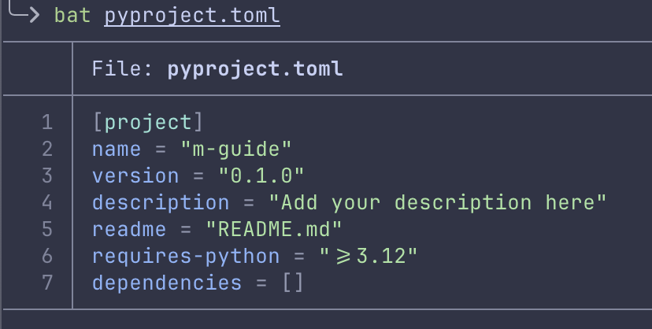
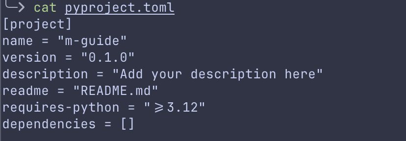

# Toolkit

Le bon outil au bon endroit c'est mieux.  

Cette section regroupe les logiciels présentés dans les autres parties du guide.

## Python

Outils de l'écosystème pour coder en Python.


<details>
<summary><a href="https://positron.posit.co/" target="_blank">Positron (IDE)</a></summary>

Positron est un fork de VSCode par Posit pour les datasciences et rapprocher créer un outil Python familier aux développeurs R. 

En 2 mots: c'est VSCode qui se déguise en RStudio. VSCode adapté pour les datasciences.  

Les avantages majeurs par rapport à VScode sont :
- Support de R et de Python nativement
- Même layout que RStudio - même logique que RStudio
- Data explorer
- UI adaptée pour Python et R (passage de Python à R et de choix de l'environement virtuel ergonomique)
- Support natif pour Quarto, Shiny, Air (formatter pour R)

C'est donc un IDE moderne, qui corriges tous les manques de VScode pour les data sciences et l'exploration de données, dans une solution intégrée.  
Positron s'inspire beaucoup de RStudio et pour le mieux.


>Posit ne compte pas arrêter de supporter RStudio, qui reste le meilleur outil pour développer en R. Positron est une super alternative pour tout utilisateur de R qui doit se mettre à Python.

</details>
 
<details>
<summary><a href="https://docs.astral.sh/uv/pip/environments/" target="_blank">UV (gestionaire d'environement)</a></summary>

UV est présenté dans la section sur les gestionnaires d'environements.

Commandes les plus utiles de UV

```sh
# Doc de la CLI
uv help 
# détail d'une commande
uv help <command>  # ex : uv help init

# Initialiser un projet
uv init <nom-projet>

# Ajouter/ supprimer un package
uv add <package>
uv remove <package>

# Installer ou mettre à jour l'environement virtuel
uv sync

# Schema des dépendances du projet sous forme d'arbre
uv tree
 
# Run une commande
uv run <command> # ex : uv run marimo edit <notebook.py>

# Run un script
uv run <file.py>
```
</details>


<details>
<summary><a href="https://pixi.prefix.dev/latest/" target="_blank">Pixi (gestionnaire d'environement pour conda)</a></summary>

Pixi est présenté dans la section sur les gestionnaires d'environements.

Commandes les plus utiles de Pixi

```sh
# Doc de la CLI
pixi help 
# détail d'une commande
pixi help <command>  # ex : pixi help init

# Initialiser un projet
pixi init <nom-projet>

# Rechercher/ ajouter/ supprimer un package
pixi search <package>
pixi add <package>
pixi remove <package>

# Installer ou mettre à jour l'environement virtuel
pixi install

# Schema des dépendances du projet sous forme d'arbre
pixi tree

# Ouvrir un shell avec l'environement (remplace 'conda activate', plus besoin de 'conda deactivate', il suffit de faire 'exit')
pixi shell

# Run une commande
pixi run <command> # ex : pixi run python <file.py>
```

</details>

<details>
<summary><a href="https://docs.astral.sh/ruff/" target="_blank">Ruff (linter and formatter)</a></summary>

Ruff est LE formatter de Python, extrèmement rapide et très bien intégré/ supporté par les IDE.  

Je recommande d'utiliser Ruff avec l'IDE. Chaque fois que tu sauvegarde ton script, ruff le formatte. Positron utilise Ruff par default (normalement rien à configurer).

Tu aussi peux utiliser Ruff comme un outil à part à l'aide du terminal.
```sh
ruff check <script.py>
# ou voir toutes les commandes
ruff help
```
</details>

<details>
<summary><a href="https://pyrefly.org/en/docs/" target="_blank">Pyrefly (type checker)</a></summary>

Pyrefly est un Type checker pour Python, extrèmement rapide et très bien intégré/ supporté par les IDE.  

Comme pour Ruff, Pyrefly est le type checker par défault de Positron.

</details>

[En savoir plus sur les code formatter/ code linters et type checker](https://github.com/) # `LINK TO gh PAGE`


## Librairies Python pour aider la transition depuis R

Cette section fait le lien direct entre les packages que l'on utilise sur R et leur équivalent ou solution la plus proche en Python. Soit parce que la philosphie du package R est préservée, soit parce que la librairie est plus facile à prendre en main que le standard de Python.

Datasets :
- [Polars](https://pola.rs/) - Synthax expressive proche de dyplr, method chainning. Evite la rugosité de la synhtax de Pandas quand on vient de R. Lazy mode comme [dtplyr](https://dtplyr.tidyverse.org/) et [duckplyr](https://duckplyr.tidyverse.org/).

<details>
<summary>Comparatif synthaxe dplyr, polars and pandas</summary>

  ```r
  # dplyr
  df %>%
    filter(mpg > 20) %>%
    select(cyl, mpg) %>%
    mutate(kpl = mpg * 0.425)
  ```  
  
  ```python
  # polars
  df.filter(pl.col("mpg") > 20) \
    .select(["cyl", "mpg"]) \
    .with_columns((pl.col("mpg") * 0.425).alias("kpl"))
  ```
  

  ```python
  # pandas
  df = df[df["mpg"] > 20][["cyl", "mpg"]]
  df["kpl"] = df["mpg"] * 0.425
  ```
</details>


Data Viz :
- [Seaborn](https://seaborn.pydata.org/) - Seaborn est une sourcouche de Matplotlib, on utilise les deux librairies ensemble. API moins rugeuse que Matplotlib pour les utilisateurs venant de R. Il permet juste de mieux et plus facilement exprimer le graphique, ce qui est souvent difficile avec Matplotlib en venant de ggplot2.
- [Plotnine](https://plotnine.org/) - ggplot2 adapté pour Python (synthax similaire, pratique si on vient de R).
- [Great Tables](https://posit-dev.github.io/great-tables/articles/intro.html) : gt mais sur Python.

Notebooks :
  - [Marimo](https://marimo.io/) - Notebook pur Python, réactif, riche et moderne. `LINK TO NB PAGE`
    
    
    
## L'écosystème de Python pour les data sciences et les statistiques
(uniquement les packages principaux, les plus utilisés, les plus populaires ou les plus utiles venant de R)

### Scientifique
- [Numpy](https://numpy.org/): implémentation pour python des vecteurs (même logique que R, tout est un vecteur (array en numpy))
- [Scipy](https://scipy.org/) : librairie de statistique, nombreux algorithmes prêt à être utilisés (construit par dessus numpy)
- [Statsmodels](https://www.statsmodels.org/stable/index.html) : librairie d'algorithmes qui reprend l'interface de formule de R.

### Dataframe
- [Pandas](https://pandas.pydata.org/docs/) : librairie la plus populaire, la plus connue et la plus utilisée (construit par dessus numpy)
- [Polars](https://docs.pola.rs/) : API plus expréssive, très performant, possède un mode lazy

### Machine Learning
- [scikit-learn](https://scikit-learn.org/stable/index.html) : tout le Machine Learning, très bonne documentations et très bon exemples. LA raison pour laquelle le ML est si populaire sur Python. (construit par dessus numpy et scipy)
### Deep Learning
- [Pytorch](https://pytorch.org/) : grand écosystème de Deep Learning, outils pour créer et déployé des réseux de neurones. Populaire dans la recherche.
- [TensorFlow](https://www.tensorflow.org/) : globalement le même usage que PyTorch mais plus utilisé dans l'industrie et pour la mise en production des modèles.
- [Transformers](https://huggingface.co/docs/transformers/index) : modèles de Deep Learning : NLP, vision, audio, video. Simple d'utilisation et propose des modèles pré-entrainés

### Databases
- [sqlite3](https://docs.python.org/3/library/sqlite3.html) : module de Python pour intéragir avec les bases de données SQL
- [Duckdb](https://duckdb.org/) : database SQL pour l'analyse de données. Très performant, parfait pour traiter des gros volumes localement

### Data viz et applications
- [Matplotlib](https://matplotlib.org/) & [Seaborn](https://seaborn.pydata.org/) : Duo pour la dataviz
- [Streamlit](https://streamlit.io/) : Rshiny mais pour python

### NLP
- [Spacy](https://spacy.io/) : pipelines complets et modulaires de NLP. Très utilisé dans l'industrie et en production
- [NLTK](https://www.nltk.org/) : librairie complète de NLP. Facile à utiliser. Très utilisée dans la recherche

### Autres
- [FastAPI](https://fastapi.tiangolo.com/) : Faire des API performante, facile à prendre en main.
- [Pydantic](https://docs.pydantic.dev/latest/) : Data validation

<details>
<summary>Avancé</summary>

### Test
- [Pytest](https://docs.pytest.org/en/stable/) : standard pour écrire des tests. 100% compatible avec les modules de testing de Python.

### Web scraping
- [Beautiful soup](https://beautiful-soup-4.readthedocs.io/en/latest/) : pour parser HTML et XML. Ne prend pas en charge le JavaScript.
- [Scrapy]() : Framework complet de scraping. Ne supporte pas le JavaScript.
- [Playwright](https://playwright.dev/python/docs/intro) : librairie d'automatisation de navigateur web et de scraping de pages dynamiques (les sites chargés en JavaScript).

### AI
- [LangChain](https://docs.langchain.com/oss/python/langchain/overview) : Framework IA le plus utilisé
- [Pydantic-ai] : Framework IA qui intègre le type safety et le data validation au coeur de son design. Parfait pour développer des solutions propres et robustes.
- [Ollama](https://docs.ollama.com/), [LMStudio](https://lmstudio.ai/docs/python) et [vLLM](https://vllm.ai/) : "inference and serving engines" pour utiliser des LLM en local. Ils servent à démarer un serveur local pour connecter l'inférence du LLM. vLLM est plus puissant et la plus complexe. LMStudio permet de facilement utilisé des modèles MLX (pour les puces Apple)

</details>


## Pour aller plus loin avec le terminal (optionel)

Le terminal d'origine est sobre et moche. Texte blanc sur fond noir.  
Le terminal intégré à l'IDE est exactement la même fenêtre mais dans l'éditeur.  
Il est parfaitement fonctionnel mais il donne pas envie.  

Il est possible qu'un jour, à force de passer du temps dans ce rectangle noir, tu ais envie de couleurs et de plus d'ergonomie. Le terminal est extensible sans limites et de nombreux logiciels existent justement pour rendre cette expérience plus agréable.

Dans cette sous section, je présente quelques améliorations basiques, pour rendre l'expérience du terminal meilleure. Ces outils vont aussi améliorer le terminal intégré dans l'IDE.

- [Tldr](https://github.com/tealdeer-rs/tealdeer) : Explique une commande avec des exemples simples et concrêt (suffit souvent à se débloquer et éviter de devoir aller dans la doc)
- [Bat](https://github.com/sharkdp/bat) : Remplacement de `cat` avec synthax highlighting

<details>
<summary>bat vs cat</summary>





</details>

- [Eza](https://eza.rocks/) : Remplacement de "ls", plus fonctionalités et des couleurs

- [Zoxide](https://zoxide.org/) : Remplacement de "cd", mémorise les dossiers visités
